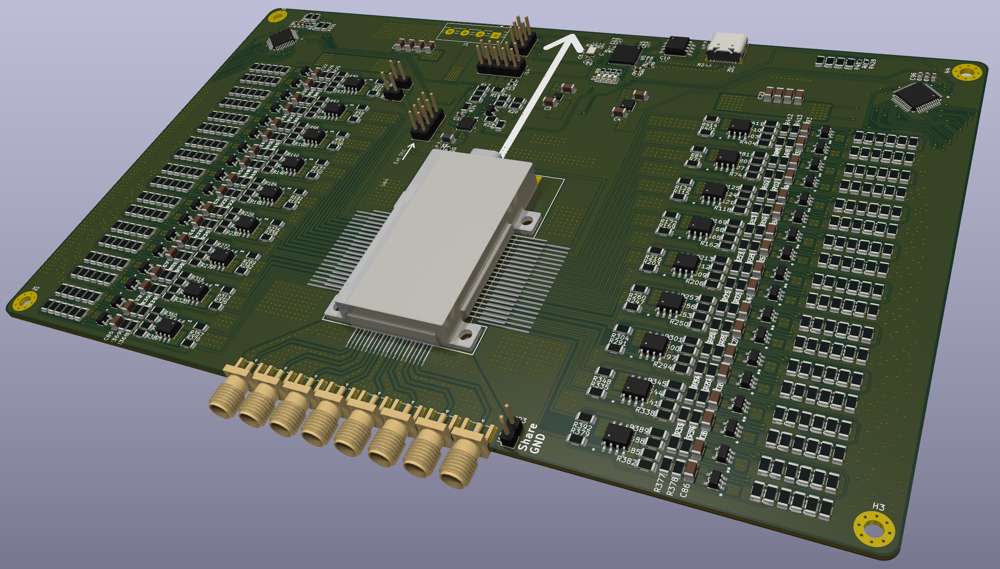
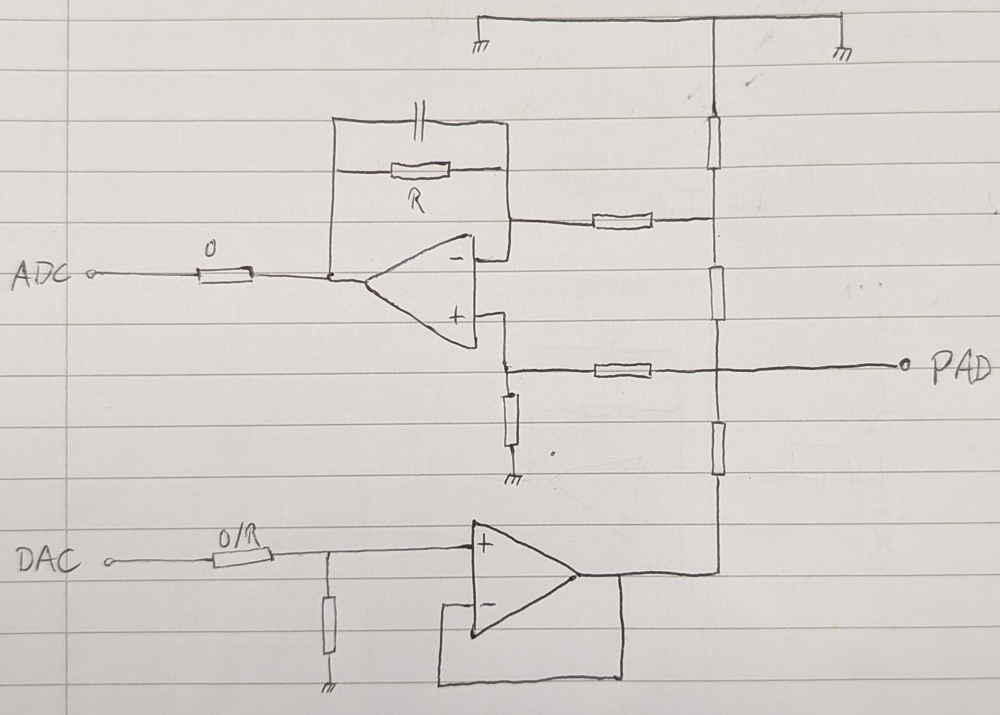

# Mount PCB for Somerville box
{width=75%}

# Steps in PCB design and manufacture
  1. Collect requirements and specs
  1. Circuit design
  1. Components selection
  1. Creation of custom symbols/footprint
  1. Schematic
  1. PCB layout
  1. Submission to manufacturer
  1. Firmware development and testing
  1. Go back to the step where you made some stupid mistake and reiterate the process

# Tool: Kicad
{.center width=20%}

- Open source electronic CAD (ECAD, aka EDA)
- Targets only PCB design \footnote{I'm sure it is potentially possible to extend its capabilities to chip design}
- Can be used as graphic frontend for ngspice (or other spice-like network simulators)
- Provides graphic and a python (socket-based) interface, especially useful to automate PCB layout
- Can generate 3D models of the final product
- Interface with version control software

# Collect requirements and specs
- Ask for the most detailed description, fill the gaps and feed back
- Once fixed do not change, if needed start over
- Make as few assumptions as possible

# Circuit design and components selection
* Divide the circuits into functional blocks and find a topology that implements the target functionality.
* Select components depending on requirements and availability.
* Run simulations if possible/required.
* Always think about testing

In this presentation example:

- Somerville DC pad analog frontend (next slide)
- AD/DA conversion
- TEC control
- Controller

# Example: Analog frontend for Somerville DC pin

::: columns

:::: column
Each pin can be configured as:

- Voltage source, capable of driving 200mA, $\pm$ 10V
- Ground reference
- Ground reference with current sensing
- Transimpedance amplifier

---

Configuration is done during assembly.

::::

:::: column

::::

:::

# Creation of custom symbols/footprint

* The workflow of PCB design: schematic $\rightarrow$ DRC $\rightarrow$ layout $\rightarrow$ DRC

* In the schematic you place and connect symbols, documenting the functionalities.

* In the layout phase, footprints associated with the symbols are placed on the PCB, electrical connections are made using traces.

## Symbols and footprints for lot of components can be found online, it is sometimes needed to make custom ones (e.g. somerville box)

# Schematic
- Organize the functional blocks to make it readable
- Comment to make design choices clear
- Put references to datasheet/images in case this helps
- Use the features offered by the software:
    - Hierarchical sheets
    - Net classes
    - Labels
    - Buses

# PCB layout
- Make your life easier when laying out test areas
- Mind mechanical constraints
- Check on the manufacturer website what are the capabilities (minimum track width, minimum spacing, copper thickness...) and set them on the software for correct DRC
- Add Wave Photonics logo and version information on it

# Submission to manufacturer
- (I'll do it next week)
- There are many, with a wide range of prices
- I'll not recommend one
- Some are specialized on mass manufacturing, other on small scale and precise assembly (e.g. UHF PCBs, X-ray check, space applications)

# Firmware development and testing
- You should have an ordered list of tests to be done
- It is quite common to start by writing the firmware for logic components on the board
- Always more time consuming than you think

# Questions?
The first Wave Update shorter than half an hour ends here.
